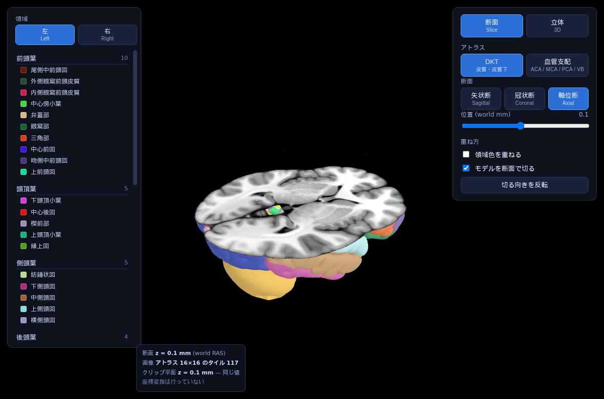
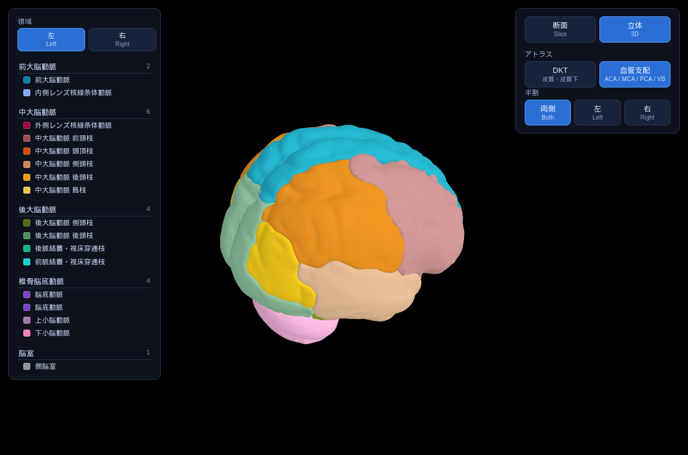

# brain-slice-viewer

3D の脳モデルを任意の断面で切り、切り口に MRI と領域色を出す Web ビューア。ビルド手順は無く、
依存は同梱の three.js だけ。

**[デモを開く](https://tontonkurakura.github.io/brain-slice-viewer/viewer.html)**


## 特長

- **断面モードと立体モード** — 断面で切って中を見るか、3D モデルだけを回すか
- **2 つのアトラス** — DKT（皮質・皮質下 93 領域）と血管支配（ACA / MCA / PCA / VB、32 領域）
- **領域の同定** — カーソルを乗せると名前、クリックで選択（3 つまで）
- **座標変換なし** — メッシュも断面も同じミリ座標に載っているので、位置合わせの係数が存在しない
- **自己完結** — 外部への通信ゼロ。回線の無い環境でも開く
- **スマートフォン対応**

## 動かす

静的ファイルを配るだけ。

```bash
git clone https://github.com/tontonkurakura/brain-slice-viewer.git
cd brain-slice-viewer
python3 -m http.server 8791
# http://127.0.0.1:8791/viewer.html
```

## 画面

| 領域色を外すと MRI が見える | 立体モード（血管支配） |
|---|---|
|  |  |

## 操作

モードの切り替えは右上の一番上にある。

| | 断面モード | 立体モード |
|---|---|---|
| 表示 | 断面板と、それで切ったモデル | モデルだけ（板もカットラインも出ない） |
| ホイール | 断面を 1 枚めくる（Shift で 10 枚） | 拡大縮小 |
| カーソルを乗せる | 断面上のその位置の領域名 | 最前面に見えている領域名 |
| 専用の操作 | 断面の向き / 位置 / 重ね方 / 切る向き | 半割 / 皮質の表示 |

| | |
|---|---|
| 左ドラッグ | 回転 |
| 中ボタンドラッグ | 拡大縮小（Ctrl + ホイールでも可） |
| アトラス（右上） | DKT ⇄ 血管支配 |
| 領域を選ぶ（左） | 強調する。断面モードでは代表スライスへ移動 |
| 左／右（左上） | 一覧に出す側。正中の構造は常に出る |

ホイールを断面めくりに割り当てた都合で、ズームは中ボタンと修飾キーにある。立体モードの「半割」は
クリップではなく、反対側のメッシュを消している。皮質メッシュが開いた殻なので、x = 0 で切ると
切り口から裏面が見えて中空になるため。脳幹と第三・第四脳室は左右を持たないので、半割しても残る。

## 仕組み

3D の脳モデルは表面の三角形の集まりで、中身が無い。平面で切っても切り口に見えるのは殻の裏側だけで、
実物なら現れる白質も基底核も存在しない。そこで、切った位置の MRI 断面をその平面に貼る。領域ごとに
塗り分けた画像も重ねられるので、切り口が何という構造なのかまで読める。

成立の条件は、断面画像とモデルの位置が正確に一致していることだけ。ずれていても画面はもっともらしく
見えるので、気づけるのは神経解剖を知っている人に限られる。

### 座標

原点を脳のおおよその中心に置き、右を +X、前を +Y、上を +Z とするミリ座標を world RAS と呼ぶ。
この実装は次の 4 つをすべてその数値で持つ。

| | 値 |
|---|---|
| GLB の頂点座標 | world RAS (mm) |
| 断面板を置く位置 | world RAS (mm) |
| クリップ平面の位置 | world RAS (mm) |
| 断面画像のスライス番号 | `slice_metadata.json` の `planes.<面>.world_coords` |

4 つが同じ数値なので、座標を変換するコードがどこにも無い。冠状断を y = −20.1 mm に出す手順は
これで全部になる。

```
添字     = planes.coronal.world_coords.indexOf(-20.1)
タイル   = その添字
断面板   = y = -20.1
クリップ = y = -20.1
```

変換式を書きたくなったときは、たいていどこかで別の座標系が混ざっている。

前の実装ではモデルが表示用にスケール・センタリングされていたため、断面と突き合わせる変換が要った。
その変換を「モデルの外形と画像の外形を一致させる」近似で作ったところ、3 軸で 3〜6% のスケール誤差が
出たうえ、前後軸は符号すら表現できず 165mm ずれた。前頭極を選ぶと後頭部が出る状態でも、画面の上では
断面が動いているようにしか見えなかった。座標系をひとつに畳めば、この種のずれはそもそも表現できない。

### 断面画像

全スライスを 1 枚の大画像に敷き詰めてある（256 枚 → 16×16 のタイル、4096×4096）。1 枚ずつ取りに行く
作りだと、ホイールを速く回したときに読み込みが追いつかず断面が前の画像のまま滑る。アトラスなら最初に
一度読むだけで、以降のめくりは UV オフセットの変更で済む。

ラベル画像は可逆圧縮。画素の色から領域を逆引きするので、不可逆だと色が 1 ずれただけで別の領域として
解決されてしまう。拡大も `NearestFilter` で、線形補間すると存在しない領域の色が生まれる。

## 別のアプリで作り直す場合

| 読むもの | 中身 |
|---|---|
| [docs/spec.md](docs/spec.md) | 座標の取り決め、断面の出し方、受け入れテスト、既知の落とし穴 |
| `assets/slice_metadata.json` | 実装が実際に読む値。スライス座標・タイルの並び・軸の向き |
| `viewer.html` | 上の 2 つを three.js で実装したもの。判断の理由はコメントにある |

three.js に固有なのはテクスチャアトラスの貼り方くらいで、座標の扱いは描画エンジンに依存しない。
自前の 3D モデルを持ち込む場合、その頂点が world RAS に載っているかどうかは機械で判定できる
（spec.md の「既存の 3D モデルを使いたい場合」）。

## ファイル

| | |
|---|---|
| `viewer.html` | 本体。HTML / CSS / JS が 1 ファイル |
| `brain.glb` | DKT のモデル。93 領域 / 7.5MB / 頂点は world RAS (mm) |
| `brain_arterial.glb` | 血管支配のモデル。32 領域 / 切り替えたときに読む |
| `assets/<面>/t1_atlas.webp` | MRI 断面 256 枚を 16×16 に敷き詰めた 4096×4096 / 不可逆 (q88) / アトラス間で共有 |
| `assets/<面>/label_atlas.webp` | 領域色の断面 (DKT)。可逆圧縮 |
| `assets/<面>/label_atlas_arterial.webp` | 領域色の断面 (血管支配)。可逆圧縮 |
| `assets/slice_metadata.json` | スライス座標 / タイルの並び / 軸の向き |
| `labels.json` | 領域名（日英）/ 大分類 / 色 / 代表スライス / 左右 |
| `vendor/three/` | three.js r163 無改変 (MIT) |
| `docs/spec.md` | 仕様 |

## データの素性

使っているのは 1 例の標準脳。個人の MRI ではなく、患者情報は含まない。

| | |
|---|---|
| 標準脳 | MNI152。Connectome Workbench 由来 / 0.7375mm / 頭蓋剥離済みの HCP 系平均脳 |
| 領域分割 | FastSurfer が出す DKT。皮質は FreeSurfer の表面から、皮質下はラベルボリュームから起こしている。色は FreeSurferColorLUT |
| 血管支配 | [JHU Arterial Atlas](https://github.com/Chin-Fu-Liu/Arterial_Atlas) の Level 1 / 32 領域 |
| 表示の左右 | neurological（画像の左が患者の左） |

血管支配アトラスは、どの動脈が詰まるとどこが傷むかを脳全体に塗り分けた地図で、同梱しているものは
急性期脳梗塞 1,298 例の病変分布から作られている。MNI152 1mm のグリッドから最近傍でこの標準脳の空間へ
移してあり、側脳室の重心で 1.9〜2.5mm の一致を確認した。

左右を neurological にしたのはモデルに合わせるため。モデルは常に解剖学的な向きにあるので、
radiological（画像の左が患者の右）へ切り替えるとモデルと断面で左右が食い違う。

## 制限

用途は参照実装で、臨床で使うものではない。

- 被験者ごとの MRI には対応しない。同梱の標準脳 1 例に固定してある
- 領域数を数百規模に増やすと、色から領域を逆引きする作りが破綻する。現状でも左右は同じ色
  （95 領域に対して 53 色）で、world x の符号で左右を判別している
- 4096×4096 のテクスチャを使う。`gl.MAX_TEXTURE_SIZE` がそれ未満の環境は対象外で、そのとき
  何が見えるかは確認していない
- 読み込んだテクスチャを破棄しないため、断面とアトラスを一通り切り替えると GPU 側の使用量が積み上がる

## ライセンス

| | |
|---|---|
| `brain_arterial.glb` / `assets/<面>/label_atlas_arterial.webp` | [CC BY-SA 4.0](https://creativecommons.org/licenses/by-sa/4.0/)（JHU Arterial Atlas から継承） |
| `vendor/three/` | MIT |
| MNI152 / FreeSurfer / FastSurfer | 各配布元に従う |

資産を生成する Python コードは同梱していない。

## 引用

血管支配アトラスの出典。

> Liu C-F, et al. *Digital 3D Brain MRI Arterial Territories Atlas.*
> Scientific Data 10, 74 (2023). © 2021 The Johns Hopkins University

## 用語

| | |
|---|---|
| world RAS | 実寸のミリ座標。+X が右、+Y が前、+Z が上。MNI 座標と同じ考え方 |
| DKT | 皮質の区分法（Desikan-Killiany-Tourville）。片半球 31 領域 |
| 血管支配 | どの動脈が詰まるとどこが傷むかの区分。ACA / MCA / PCA / VB |
| 断面板 | 切り口に置く矩形。ここに MRI と領域色を貼る |
| クリップ平面 | この面より手前は描かない、という 3D 表示の指定 |
| アトラス（テクスチャ） | 多数の画像を 1 枚に敷き詰めたもの。断面 256 枚が 1 ファイルに入る |

「アトラス」は脳の区分（DKT・血管支配）と、画像を敷き詰めたテクスチャの両方を指す。文脈で読み分けたい。

分からない点は Issues へ。
