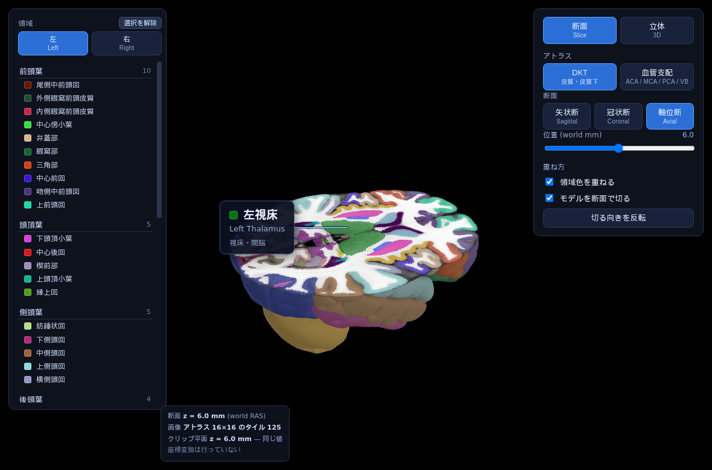

# brain-slice-viewer

3D の脳モデルを任意の断面で切り、切り口に MRI と領域色を出す Web ビューア。

**[デモを開く](https://tontonkurakura.github.io/brain-slice-viewer/viewer.html)**

## 概要

- MNI152 標準脳を用いた、3D モデルと断面画像のハイブリッドモデル
- 断面モードと立体モードを用意
- アトラスは 3 つ。解剖学領域のマクロ（脳葉など 10 区分）とミクロ
  （Desikan-Killiany-Tourville Atlas、93 領域）、JHU Arterial Atlas（血管支配領域 32）
- 既定はマクロ
- 座標はすべて world RAS (mm)。メッシュも断面も同じ数値で持つので、座標変換のコードが無い
- 依存は同梱の three.js r163 だけ。ビルド手順も外部への通信も無い
- 静的ファイルを配るだけで動く（`python3 -m http.server`）
- 仕様は [docs/spec.md](docs/spec.md)
- 用途は参照実装で、臨床で使うものではない

## ライセンス

| | |
|---|---|
| `brain_arterial.glb` / `assets/<面>/label_atlas_arterial.webp` | [CC BY-SA 4.0](https://creativecommons.org/licenses/by-sa/4.0/)（JHU Arterial Atlas から継承） |
| `vendor/three/` | MIT |
| MNI152 / FreeSurfer / FastSurfer | 各配布元に従う |

## 引用

血管支配アトラスの出典。

> Liu C-F, et al. *Digital 3D Brain MRI Arterial Territories Atlas.*
> Scientific Data 10, 74 (2023). © 2021 The Johns Hopkins University

分からない点は Issues へ。
